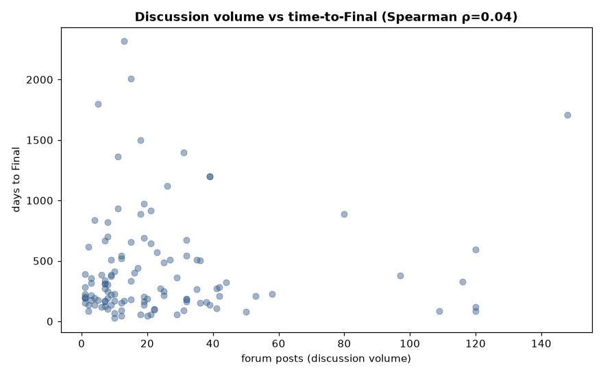
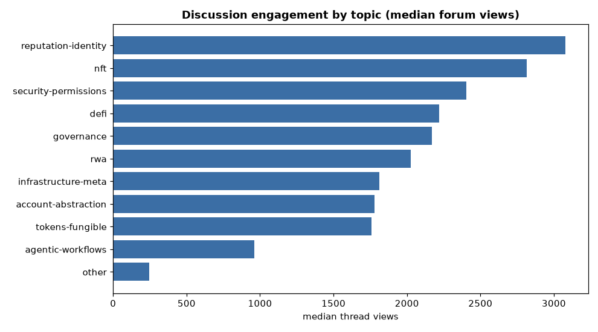

# ERC Discussion Engagement Analysis (#11)

*Does community discussion predict whether — and how — an ERC succeeds? This study joins forum-thread engagement (views, posts, participants) onto every ERC and tests it against status, topic, finalization, time-to-Final, and dependency influence. Engagement was fetched from the `discussions-to` links: **504/505 ethereum-magicians threads** (Discourse JSON) and **76/76 GitHub issues** (via `gh api`). Reproducible from `fetch_discussions.py` + `analyze_discussions.py`; data in `erc_discussions.csv` and `analysis/discussion_metrics.json`.*

---

## Coverage
- **580 of 600 ERCs** have discussion data: 504 ethereum-magicians + 76 GitHub. (16 have no `discussions-to` link, 3 point to other hosts, 1 magicians thread 404'd.)
- The cross-analysis below uses the 504 magicians threads, which carry the richest, most comparable signal (views + posts + participants). The full polite fetch hit **no Cloudflare challenge and no rate-limiting**.
- Distribution (magicians): median **2,255 views**, **8 posts**, **4 participants**; max 41,639 views (ERC-4337) and 306 posts (ERC-8183).

---

## 1. Engagement scales cleanly with maturity

Discussion rises monotonically along the standards-track pipeline:

| Status | n | Median views | Median posts | Median participants |
|---|---|---|---|---|
| Draft | 215 | 1,177 | 5 | 3 |
| Review | 59 | 2,005 | 8 | 3 |
| Last Call | 13 | 2,471 | 12 | 5 |
| **Final** | 117 | **3,327** | **16** | **6** |
| Stagnant | 96 | 3,168 | 7 | 4 |
| Withdrawn | 4 | 924 | 4 | 2 |

**Final standards attract ~2× the engagement of the average proposal** (3,327 vs 1,977 median views for non-Final; 16 vs 7 posts; 6 vs 3 participants). The Draft→Review→Last Call→Final gradient is clean and consistent across all three metrics.

**The Stagnant anomaly:** Stagnant ERCs are the *second most-viewed* group (3,168 views) — they didn't die from neglect. They drew real attention, then stalled anyway. The classic examples are ERC-1077/1078 (gas relay / universal login, ~15k views each, Stagnant) — heavily discussed ideas that were ahead of their infrastructure.

---

## 2. But volume signals importance, not friction — and not delay

Two correlations sharpen what engagement does and doesn't mean:

- **Discussion ↔ finalization (modest positive):** log(views) vs `Final` gives point-biserial **r = 0.24 (p < 0.001)**. More discussion associates with reaching Final — but weakly. It's a *necessary-not-sufficient* signal (see §4).
- **Discussion ↔ time-to-Final (none):** forum posts vs days-to-Final gives Spearman **ρ = 0.04 (p = 0.65, n = 115)** — effectively zero.

The second result is the more interesting: **the amount of debate a standard generates has no bearing on how long it takes to finalize.** Heavily-argued standards don't finalize slower than quiet ones. Whatever drives the long, multi-year finalization times (recall account-abstraction's ~4-year median) it is **not** forum contention — it's the intrinsic difficulty and review burden of the spec itself.

- **Discussion ↔ influence (modest positive):** thread views vs dependency in-degree gives Spearman **ρ = 0.27 (p < 0.001)** — the load-bearing standards (ERC-165/721/20/4337…) also command more attention. Influence and interest travel together.

---

## 3. Where the debate is hottest

By median views, **reputation-identity (3,079), NFT (2,815), and security-permissions (2,406)** lead; mature, routine areas like tokens-fungible (1,758) and infrastructure-meta (1,814) draw less per-thread attention. `agentic-workflows` is distinctive — **low views (959) but the highest median posts (15)**: brand-new, few onlookers, but intense back-and-forth among the people building it.

**The most-viewed threads** are the marquee standards: ERC-4337 Account Abstraction (**41,639 views**), 4626 Tokenized Vaults (22,401), 4973 Account-bound Tokens (20,873), 6551 Token-bound Accounts (20,673).

**The most-argued threads** (by post count) are almost all the current frontier — and mostly still **Draft**:

| ERC | Posts | Status | Title |
|---|---|---|---|
| 8183 | 306 | Draft | Agentic Commerce |
| 8004 | 252 | Draft | Trustless Agents |
| 6551 | 224 | Review | NFT-Bound Accounts |
| 4973 | 176 | Review | Account-bound Tokens |
| 4337 | 148 | Final | Account Abstraction |

The agent and smart-account standards dominate live debate — **ERC-8183 (Agentic Commerce) and ERC-8004 (Trustless Agents) are the two most-discussed proposals in the entire corpus**, both unfinished, confirming the time-series finding that the agentic frontier is where the action now is.

---

## 4. Silence predicts failure

Splitting out the **112 "silent" proposals** (<300 views or ≤1 post): their finalization rate is just **9.8%**, versus 23% corpus-wide. A proposal that generates no discussion almost never becomes a standard. Combined with §2, the picture is:

> **Discussion is necessary but not sufficient.** No engagement → near-certain failure (10% Final). Lots of engagement → better odds but no guarantee, and *more* of it neither speeds nor slows the outcome. The forum is where standards earn legitimacy, not where they're delayed.

---

## Key findings
1. **Engagement rises monotonically Draft→Final**; Final standards draw ~2× the views/posts/participants of the rest.
2. **Stagnant ≠ ignored** — Stagnant ERCs are heavily viewed; they stalled despite attention (the "ahead of its time" pattern).
3. **Debate volume doesn't affect finalization speed** (ρ=0.04) — slowness comes from spec difficulty, not argument.
4. **Influence and attention correlate** (views vs in-degree ρ=0.27).
5. **The hottest live debates are agentic/AA standards** (ERC-8183, 8004, 6551), most still Draft.
6. **Silence is fatal** — un-discussed proposals finalize only 10% of the time.

## Limitations
- **Participant counts are capped** by the Discourse summary API (~24 max), so `participants` saturates for the busiest threads; `posts` and `views` are the unbiased volume metrics.
- GitHub threads (76) expose comment counts but not views, so they're excluded from the views-based cross-analysis (their data is in `erc_discussions.csv`).
- Views are cumulative-to-date, so older threads have had longer to accrue them — a mild confound with age/status (partly mitigated by also reporting posts/participants).
- Engagement measures *interest*, not on-chain *adoption* (that remains join #10).

### Artifacts
| File | Contents |
|---|---|
| `erc_discussions.csv` | per-ERC source, views, posts, replies, participants, likes/reactions, dates |
| `analysis/discussion_metrics.json` | all statistics above |
| `analysis/discussions/` | per-thread cached JSON (resumable fetch) |
| `analysis/figures/discussion_*.png` | the four charts |
| `fetch_discussions.py`, `analyze_discussions.py` | regenerate fetch + analysis |
