# The ERC Standards Landscape — A Data Analysis

*An analysis of all 600 Ethereum ERCs in the local `ERCs/ERCS/` corpus (created 2015–2026), built from `erc_dataset.csv` (frontmatter, semantic topic classification, dependency graph) joined with `erc_temporal.csv` (git-history-derived lifecycle dates). All figures and tables are reproducible from `compute.py`.*

---

## Executive summary

- **The corpus is young and bursty.** 600 ERCs span 2015–2026, but **40%** were filed in just two years — 2022 (122) and 2023 (120). New filings have since cooled (93 → 72 → partial-2026).
- **Most ERCs never finish.** Only **138 (23%)** are `Final`. **216 (36%)** sit in `Draft`, and **163 (27%)** are `Stagnant` — and that stagnation is concentrated almost entirely in the **2018–2021 cohorts, ~60–72% of which went stagnant.**
- **Finalization is slow: a median of ~10 months** (306 days) from `created` to `Final`, with a long tail out to 6+ years. Account-abstraction standards take the longest (median 812 days); DeFi and identity the shortest (~220 days).
- **Four standards hold up the entire dependency graph.** `ERC-165` (interface detection) is the keystone — depended on by **177** other ERCs, with **2.4×** the PageRank of anything else — followed by `ERC-721`, `ERC-20`, and `ERC-1155`. Below that the graph is shallow: **154 ERCs are fully isolated** and the deepest dependency chain is only 5.
- **The frontier is agents and accounts.** `agentic-workflows` didn't exist before 2024 and is now **100% recent**; `account-abstraction` is **48% recent but only 9% Final** — lots of activity, little consolidation. `nft` is the opposite: mature (36% Final) and quiet.
- **A rigor gap persists.** 85% of ERCs include Security Considerations, but only **24% include test cases** and 51% a reference implementation. Even among `Final` standards, **96 lack test cases** and the hot account-abstraction area has tests in just **2%** of specs.

---

## A. Corpus overview & data quality

| | |
|---|---|
| Total ERCs | **600** |
| Date range (`created`) | 2015 → 2026 |
| `type` / `category` | **constant** — 100% `Standards Track` / `ERC` (no analytical signal; excluded as dimensions) |
| Status mix | Draft 216 · Stagnant 163 · Final 138 · Review 59 · Last Call 15 · Withdrawn 9 |
| Topic classifier confidence | high 532 · medium 66 · low 2 |
| Rows flagged for review | 196 (topic=`other`, low confidence, or a secondary topic) |

**Data-quality note.** Topics were assigned by LLM (Haiku) subagents against a fixed 11-value vocabulary; 89% are high-confidence. The lifecycle dates come from parsing `status:` changes in git diffs (`--follow` across the 2023 EIPs→ERCs migration). Three renumbered ERCs (5615, 7401, 7409) have a `Final` git date *earlier* than their reset `created` frontmatter, producing negative durations — these are excluded from timing stats and flagged as anomalies, not errors.

---

## B. Temporal dynamics — when standards were proposed

The ERC process started slowly (1 in 2015, single digits through 2017), then stepped up with the 2018 ICO/NFT wave (64). The defining feature is the **2022–2023 explosion** — 242 ERCs, **40% of the entire corpus**, in 24 months — followed by a clear cool-down (2024: 93, 2025: 72). 2026 is partial (15 to date).

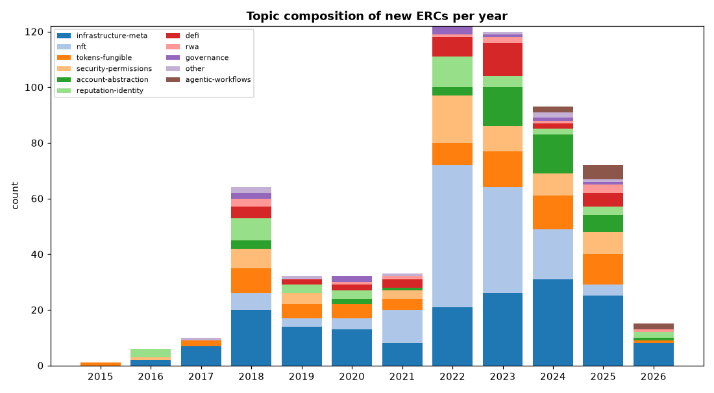

The **topic mix tells the ecosystem's story by era** (first appearance year in the corpus):

- **2015–2017 — primitives:** fungible tokens (2015), then infrastructure, identity/naming, and signing/permissions (2016).
- **2018 — the Cambrian year:** `nft`, `defi`, `rwa`, `account-abstraction`, and `governance` all first appear, riding the token boom.
- **2024 — the agent era:** `agentic-workflows` appears for the first time and immediately becomes a recurring category.

In recent years `infrastructure-meta` (registries, encodings, cross-chain plumbing) and `account-abstraction` make up a growing share, while `nft`'s share has receded from its 2021–2022 peak.

---

## C. Lifecycle — how standards mature (or don't)

The headline funnel: **600 proposed → 138 Final (23%).** The pipeline narrows hard (Review 59 → Last Call 15), and the two "dead-end" states dominate: 216 perpetual Drafts and 163 Stagnant.

Splitting by **creation-year cohort** reveals that stagnation is an *age* phenomenon, not a constant:

| Cohort | n | Final rate | Stagnant rate |
|---|---|---|---|
| 2016 | 6 | 83% | 0% |
| 2017 | 10 | 60% | 30% |
| **2018** | 64 | **16%** | **70%** |
| **2019** | 32 | **16%** | **72%** |
| 2020 | 32 | 25% | 63% |
| 2021 | 33 | 24% | 70% |
| 2022 | 122 | 34% | 38% |
| 2023 | 120 | 23% | 3% |
| 2024 | 93 | 14% | 0% |

The **2018–2021 boom cohorts are graveyards** — roughly 7 in 10 went Stagnant, as the speculative wave produced far more proposals than the community could shepherd. The `Stagnant` label (auto-applied after ~6 months of inactivity) hasn't yet caught up to 2023+ cohorts, so their low Final rates understate eventual attrition: many of today's 216 Drafts are tomorrow's Stagnant.

### Time to Final (git-derived)

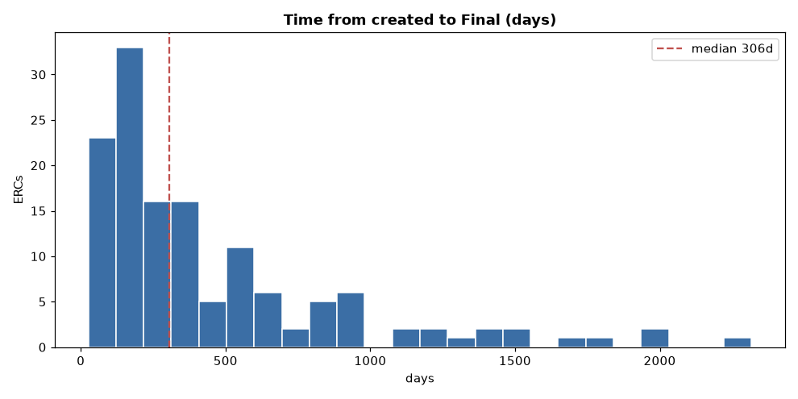

Across 137 ERCs with a clean transition history:

- **Median: 306 days (~10 months)**; mean 453 days (pulled up by a long right tail).
- Interquartile range: **162 – 570 days**; max **2,317 days** (6.3 years).

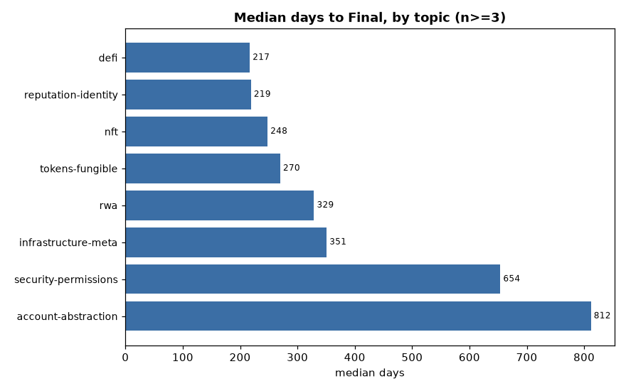

Speed varies sharply by domain:

| Fastest to Final | days | | Slowest to Final | days |
|---|---|---|---|---|
| defi (n=10) | 217 | | account-abstraction (n=4) | 812 |
| reputation-identity (n=8) | 219 | | security-permissions (n=11) | 654 |
| nft (n=48) | 248 | | infrastructure-meta (n=36) | 351 |

Token and DeFi standards, which build on well-understood primitives, finalize fastest. **Account-abstraction and security/permission standards are the slowest** — they touch consensus-adjacent, security-critical surfaces where consensus is hard-won.

### Withdrawals & stale drafts

Only **9 ERCs were formally Withdrawn**, several with instructive reasons: ERC-67 and ERC-8109 *superseded* by newer EIPs; ERC-2770 ("singleton implementation does not require standardization"); ERC-7766 (AA signature aggregation, withdrawn for "no production adoption"). These are healthy signals of a process pruning itself.

More concerning: **99 ERCs are `Draft` *and* untouched for >18 months** (the top of this list, e.g. ERCs 725, 4972, 5700, 6170…, have been silent for ~980 days). These are de-facto abandoned but not yet relabeled — a backlog-hygiene gap.

---

## D. Topic landscape

| Topic | n | | Topic | n |
|---|---|---|---|---|
| infrastructure-meta | 175 | | defi | 37 |
| nft | 136 | | rwa | 13 |
| tokens-fungible | 71 | | governance | 10 |
| security-permissions | 57 | | other | 9 |
| account-abstraction | 44 | | agentic-workflows | 9 |
| reputation-identity | 39 | | | |

`infrastructure-meta` and `nft` together are **52%** of the corpus. The large infrastructure bucket reflects how much ERC work is plumbing — registries, encodings, cross-chain addressing, interface conventions.

**Straddle analysis** (`topic_secondary`, present on 187 ERCs) maps where domains blur. The strongest bridges are between **fungible tokens ↔ NFTs** (26 ERCs straddle both directions — semi-fungible and multi-token designs), **tokens ↔ DeFi** (19), **account-abstraction ↔ security-permissions** (9, session keys and authorization), and **identity ↔ NFT** (9, soulbound/credential tokens). These are exactly the seams where the next generation of composite standards is being written.

---

## E. Dependency graph & influence — the load-bearing standards

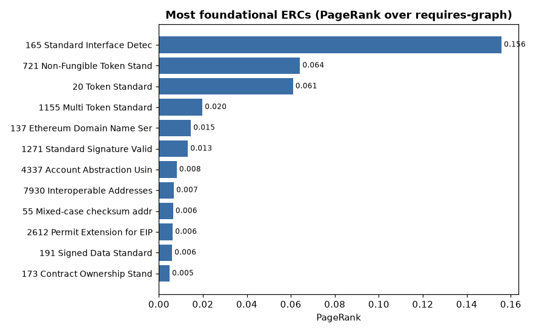

Influence is extraordinarily concentrated. Ranked by how many other ERCs formally `require` them:

| Rank | ERC | Title | Required by | PageRank |
|---|---|---|---|---|
| 1 | **165** | Standard Interface Detection | **177** | 0.156 |
| 2 | **721** | Non-Fungible Token Standard | 145 | 0.064 |
| 3 | **20** | Token Standard | 104 | 0.061 |
| 4 | **1155** | Multi Token Standard | 60 | 0.020 |
| 5 | 1271 | Signature Validation for Contracts | 27 | 0.013 |
| 6 | 137 | ENS Specification | 19 | 0.015 |
| 7 | 4337 | Account Abstraction (Alt Mempool) | 14 | 0.008 |

`ERC-165` is the **keystone of the whole graph** — nearly a third of all ERCs depend on it, and its PageRank is 2.4× the runner-up. The top four (165, 721, 20, 1155) form the bedrock virtually everything else builds on. Notably, **`ERC-4337` is the most foundational of the *new* generation**, already the 7th most-required standard.

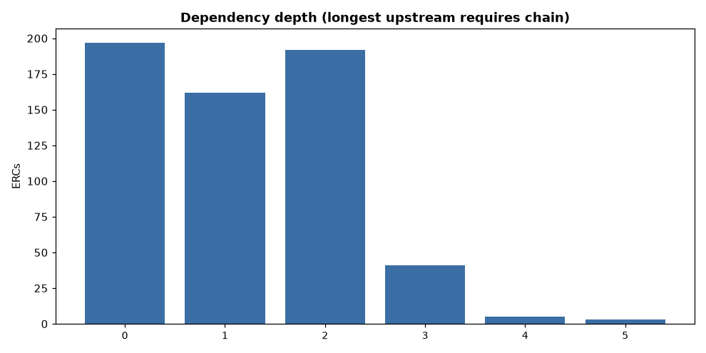

But the graph is **wide and shallow**, not deep:

- **154 ERCs (26%) are fully isolated** — no `requires`, never required.
- Depth distribution: 197 at depth 0, 162 at depth 1, 192 at depth 2; only **8 ERCs** sit at depth 4–5. The longest upstream chain is just 5.

**Formal vs. informal influence.** Comparing `requires` edges to body *mentions* (`referenced_ercs`) shows mentions closely track formal dependencies for the bedrock standards — but some standards punch above their formal weight. **ERC-4337 is mentioned 33 times but formally required only 14**, and **EIP-712** (typed-data signing, an external EIP) is referenced 52 times — these are *conventions everyone codes against* without always declaring a formal dependency. Influence-by-topic confirms the hierarchy: fungible-token, NFT, and infrastructure standards carry essentially all the in-bound dependency weight; `rwa`, `governance`, and `other` are pure leaves (≈0 dependents).

---

## F. Authorship & collaboration

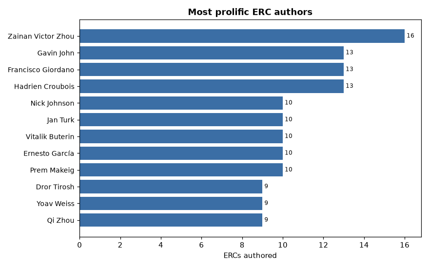

Authorship reveals the ecosystem's institutional structure. The most prolific authors cluster into recognizable camps:

- **OpenZeppelin** — Francisco Giordano (13), Hadrien Croubois (13), Ernesto García (10): the standards-library maintainers.
- **ENS** — Nick Johnson (10), Prem Makeig (10): naming/identity.
- **ERC-4337 / account-abstraction** — Dror Tirosh (9), Yoav Weiss (9), Alex Forshtat (8): the AA working group.
- **RMRK / NFT** — Jan Turk (10), Steven Pineda (9).
- Plus prolific generalists Zainan Victor Zhou (**16**, the single most prolific) and Vitalik Buterin (10).

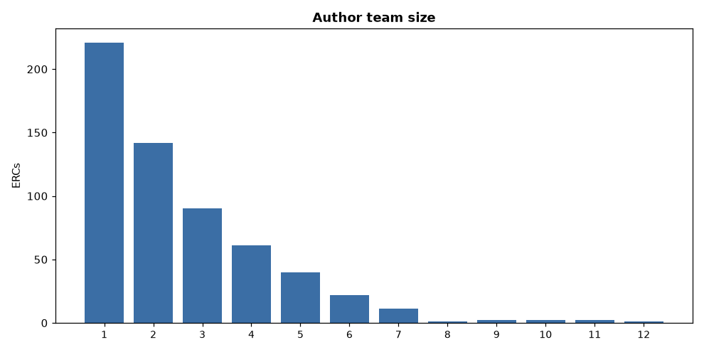

- **Team size:** median 2, mean 2.65, max 20. **221 ERCs (37%) are solo-authored.**
- **Collaboration pays off:** team-authored ERCs reach Final at **25.6%** vs **18.6%** for solo efforts — a ~38% relative lift.
- **Contributor breadth (git):** the average ERC sees ~3.5 distinct committers (max 21), i.e. real review traffic beyond the listed authors.

**Co-authorship network.** The best-connected authors — Francisco Giordano (**44** distinct co-authors), Hadrien Croubois (37), Vitalik Buterin (37), vectorized (34) — are the connective tissue linking otherwise separate working groups. The OpenZeppelin maintainers sit at the center of the collaboration graph.

---

## G. Rigor & maturity signals

EIP-1 expects a Security Considerations section (and encourages tests and a reference implementation). Across the corpus:

| Signal | All | Final | non-Final |
|---|---|---|---|
| Security Considerations | 85% | 88% | 84% |
| Reference implementation | 51% | 62% | 47% |
| **Test cases** | **24%** | **30%** | 22% |

`Final` standards are measurably more rigorous on every axis, but the **test-case gap is glaring**: even among finalized standards, **96 (70%) ship without test cases**. By topic, testing is weakest exactly where stakes are highest — **account-abstraction (2.3%)** and **security-permissions (10.5%)** have the lowest test coverage, versus NFT (34%) and governance (30%).

**The 16 `Final` ERCs without a Security Considerations section** are almost all the *ancient* foundational ones — ERC-20, 165, 721, 1155, 137, 777, 191, 1167 — authored before the section became mandatory. So this is a historical artifact, not active negligence: the bedrock of the ecosystem predates its own rigor requirements.

---

## H. Complexity

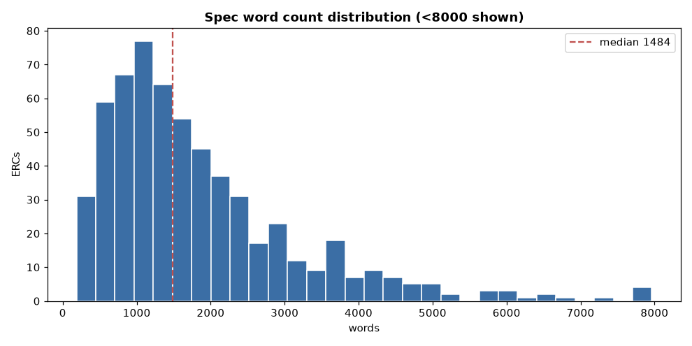

Specs are mostly compact — **median 1,485 words and 14 sections** — with a long tail. By topic, the **newest domains are the wordiest**: `agentic-workflows` (median 3,103 words) and `rwa` (2,505) demand far more specification than terse primitives like `security-permissions` (1,128) or `infrastructure-meta` (1,302).

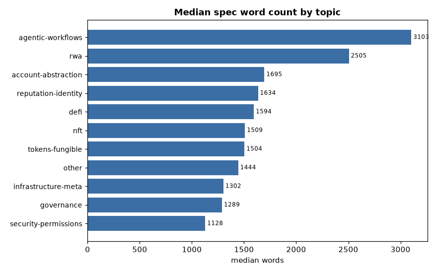

The longest individual specs are dominated by emerging, complex domains: **ERC-8257 "Agent Tool Registry" (18,789 words)**, ERC-1450 "RTA-Controlled Security Token" (17,023, an `rwa` compliance spec), and ERC-7730 "Clear Signing Format" (12,313). Agentic and real-world-asset standards carry the heaviest specification burden — consistent with their being newer, less-charted territory.

---

## I. Synthesis — where the ecosystem is heading

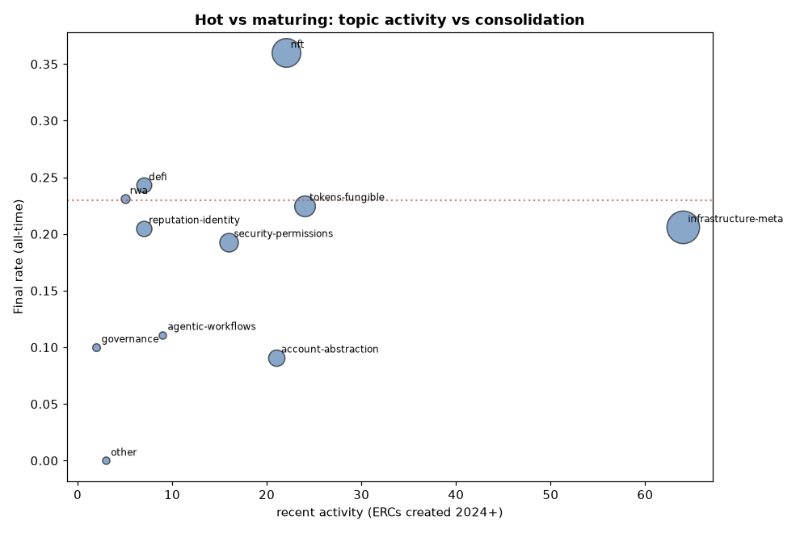

Plotting **recent activity (2024+ filings) against all-time Final rate** sorts the topics into strategic quadrants:

- **Hot & immature (top-right of attention, bottom of consolidation):** `account-abstraction` (48% of its standards are recent, only 9% Final) and `agentic-workflows` (**100% recent, 11% Final**). This is the live frontier — heavy activity, specifications still in flux, finalization yet to come.
- **Mature & cooling:** `nft` (only 16% recent but **36% Final**) — a settled domain past its proposal peak.
- **Large & ongoing:** `infrastructure-meta` (175 ERCs, 37% recent) — the perpetual plumbing layer that never stops growing.
- **Steady mid-table:** `tokens-fungible`, `defi`, `security-permissions` — established, still active, moderate finalization.

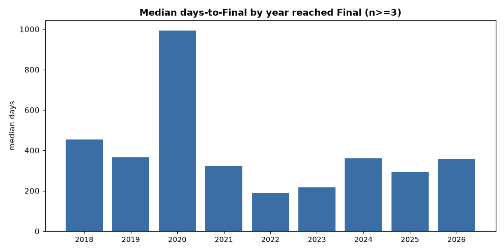

**Process velocity** (median days-to-Final by the year standards actually finalized) shows the pipeline ran *fastest in 2022* (190 days) as the community cleared a backlog of well-understood proposals, then slowed back toward ~300–360 days in 2024–2026 as the remaining work shifted to harder, security-critical, agent/account territory.

### The story in three sentences

1. **The ERC process is maturing from a token-standard factory into an agent-and-account platform** — fungible tokens and NFTs are largely settled (fast finalization, low recent volume), while account-abstraction and autonomous-agent standards are where the new, slow, heavily-specified work is concentrated.
2. **Influence is hyper-concentrated and shallow** — four standards (165, 721, 20, 1155) underpin almost everything, a quarter of all ERCs are isolated, and no dependency chain runs deeper than five.
3. **Throughput is the binding constraint, not ideas** — only 23% of proposals finalize, ~70% of the 2018–2021 boom went stagnant, 99 Drafts are silently abandoned, and rigor (especially testing) lags most in exactly the high-stakes domains now growing fastest.

---

## Limitations

- **Snapshot + reconstructed history.** Current `status` is exact; transition dates are reconstructed from git diffs across the EIPs→ERCs migration. 3 renumbered ERCs have inconsistent `created` vs. git-`Final` dates (excluded from timing). Some early ERCs predate the repo's tracked history, so their `Draft` date is unknown.
- **Topics are model-assigned** (Haiku, fixed vocabulary; 89% high-confidence, 196 rows flagged for human review in `_run_report.md`).
- **Graph metrics are corpus-internal.** `requires`/`referenced_ercs` can point to Core EIPs outside the 600-file ERC set (e.g., EIP-712, EIP-155); those appear as "external EIP" and are not nodes in the dependency graph.
- **`Stagnant` is time-lagged**, so recent cohorts' attrition is understated; **2026 is a partial year.**

---

### Reproducibility

| Artifact | Description |
|---|---|
| `erc_dataset.csv` | 600 ERCs × 30 columns (frontmatter, topic, dependency graph, structure flags) |
| `erc_temporal.csv` | git-derived lifecycle dates, commit counts, committers, time-to-Final |
| `analysis/metrics.json` | every computed statistic in this report |
| `analysis/tables/*.csv` | per-year, topic-by-year, and cohort tables |
| `analysis/figures/*.png` | all 16 charts |
| `compute.py` | regenerates metrics + figures from the two CSVs |
