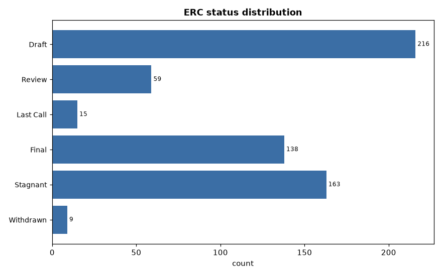
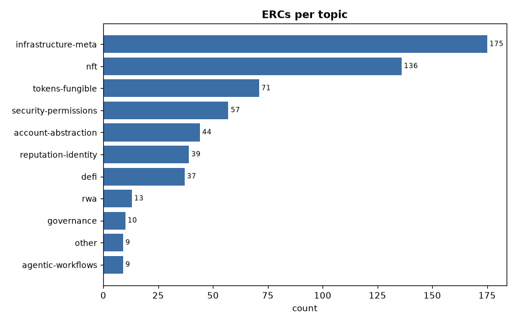
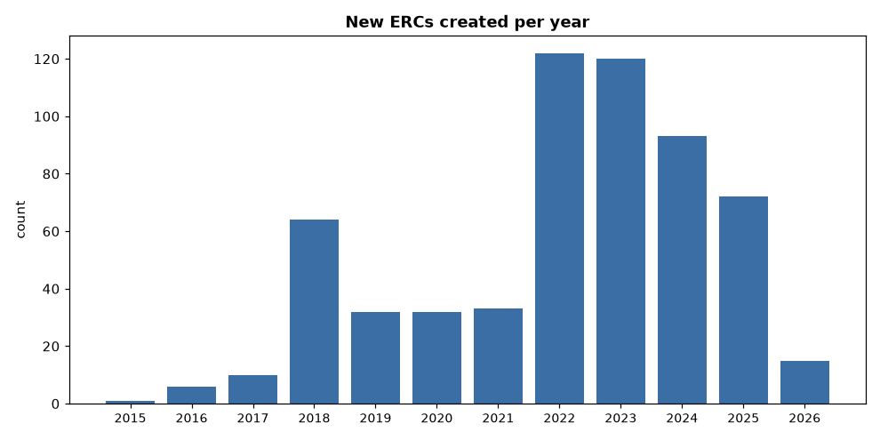
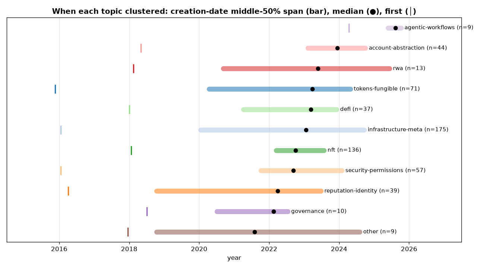
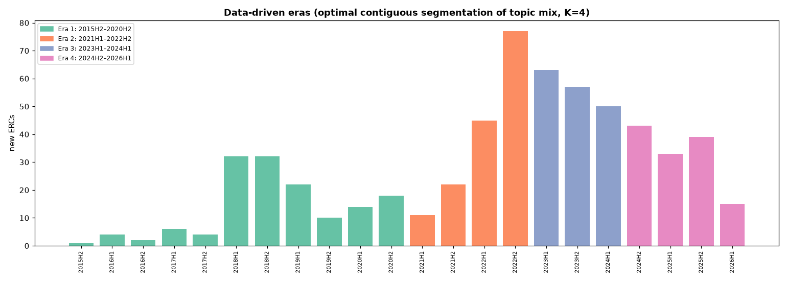
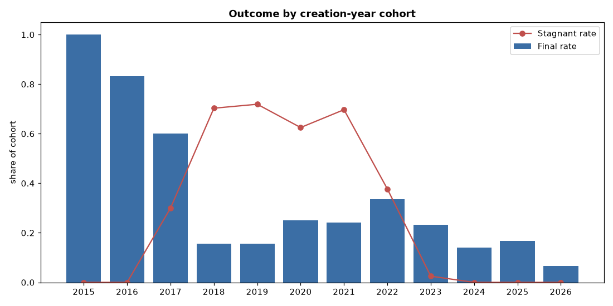
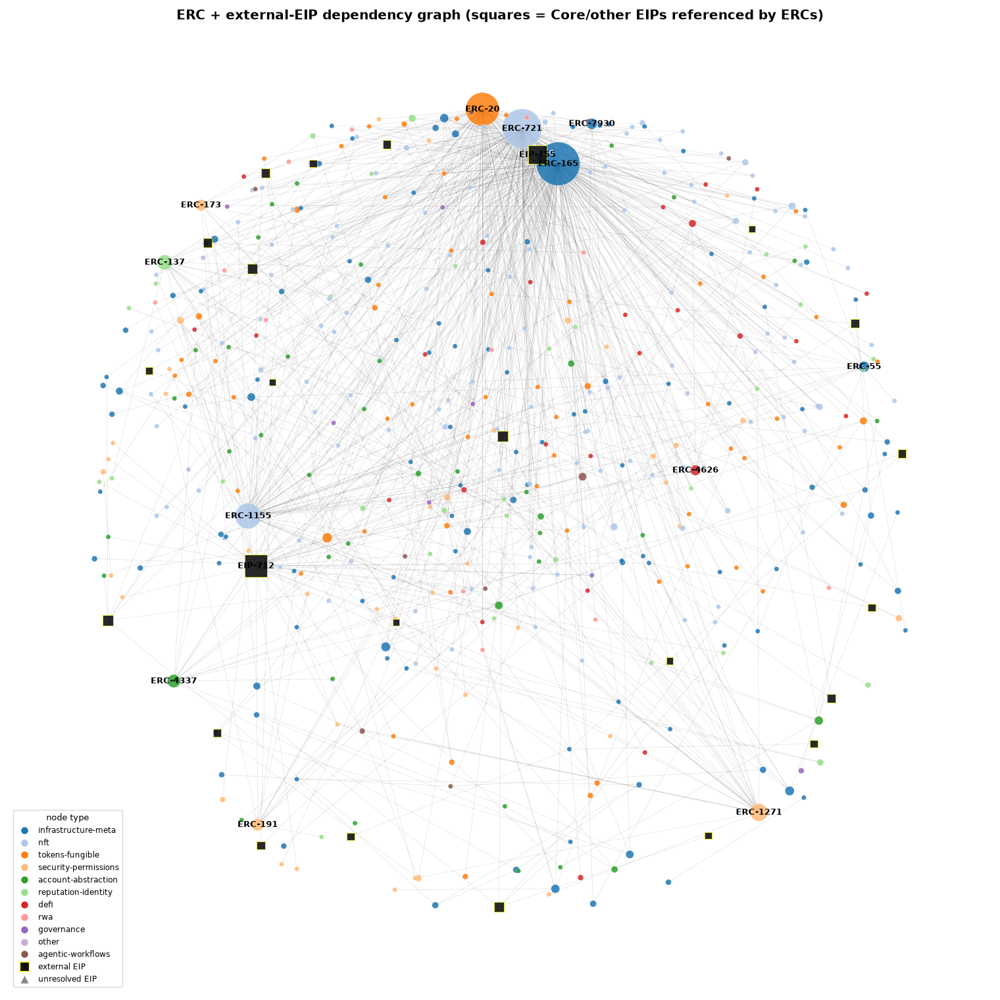
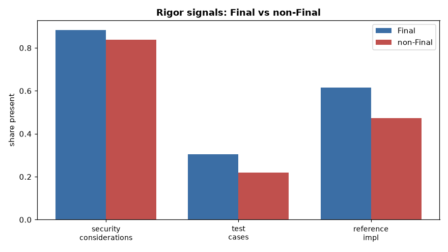
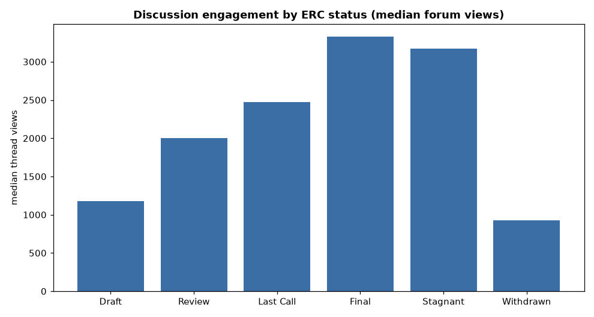
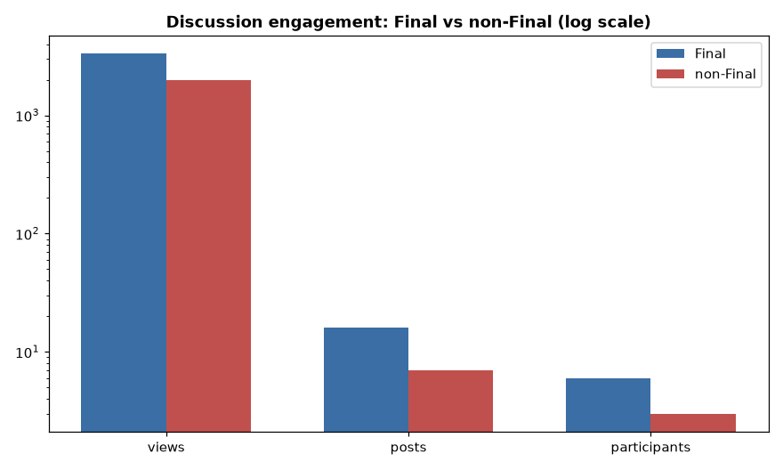

# The Ethereum ERC Standards Ecosystem — A Comprehensive Data Analysis

*A consolidated report synthesizing eight analyses of all 600 Ethereum ERCs in the local corpus (proposals created 2015–2026). It covers how the standards corpus formed, what it contains, how proposals mature (or don't), how influence and authorship are structured, how rigorous the specs are, and how the community discusses them. Every figure and statistic is reproducible from the scripts in this repository.*

*This document is a unified read of six standalone analyses, which remain available with fuller detail: [`ERC_ANALYSIS.md`](ERC_ANALYSIS.md) (foundation), [`FURTHER_ANALYSIS.md`](FURTHER_ANALYSIS.md) (network/survival/predictor deep dives), [`EXTERNAL_EIP_GRAPH.md`](EXTERNAL_EIP_GRAPH.md), [`TIMESERIES_ANALYSIS.md`](TIMESERIES_ANALYSIS.md), [`DISCUSSION_ANALYSIS.md`](DISCUSSION_ANALYSIS.md), and the build [`_run_report.md`](../_run_report.md).*

---

## Executive summary

Eight studies converge on five theses about the ERC ecosystem:

1. **A tiny core carries the whole system.** Four standards (ERC-165, 721, 20, 1155) plus EIP-712 underpin the entire dependency graph; a handful of teams (OpenZeppelin, ENS, the ERC-4337 group, RMRK) and individuals (Nick Johnson, Francisco Giordano, Vitalik Buterin) dominate authorship, collaboration, and the persistent contributor base simultaneously.
2. **Domain determines destiny.** Whether and how fast a proposal finalizes is driven far more by *what* it is than *who* writes it: NFT extensions finalize fast and often; account-abstraction grinds for ~4 years at a 15% two-year success rate.
3. **The funnel is leaky by design — and getting leakier.** Only 23% of ERCs reach Final; survival analysis says fewer than a third *ever* will; 78% of authors write exactly one ERC; most Drafts die after a single commit; contributor retention has fallen from 53% (2017) to ~11% (recent cohorts).
4. **The frontier has rotated to agents and accounts.** Token and NFT standards are largely settled; account-abstraction and autonomous-agent standards are where the newest, slowest, longest, most-debated, and least-tested work now concentrates — high activity, low consolidation, in security-critical territory.
5. **Discussion confers legitimacy, not delay.** Engagement rises monotonically toward Final and silence is near-fatal (10% finalization), yet the *volume* of debate has no relationship to finalization speed — slowness comes from spec difficulty, not argument.

---

## Contents
1. [Dataset & method](#1-dataset--method)
2. [Corpus overview](#2-corpus-overview)
3. [Temporal dynamics & eras](#3-temporal-dynamics--eras)
4. [Topic landscape & convergence](#4-topic-landscape--convergence)
5. [Lifecycle, finalization & survival](#5-lifecycle-finalization--survival)
6. [Dependency graph & influence](#6-dependency-graph--influence)
7. [Authorship, collaboration & retention](#7-authorship-collaboration--retention)
8. [Rigor & complexity](#8-rigor--complexity)
9. [Community discussion & engagement](#9-community-discussion--engagement)
10. [Cross-cutting synthesis](#10-cross-cutting-synthesis)
11. [Limitations](#11-limitations)
12. [Reproducibility & artifact index](#12-reproducibility--artifact-index)

---

## 1. Dataset & method

The dataset is `erc_dataset.csv` — **600 ERCs**, one row per `ERCs/ERCS/erc-<N>.md` file, built by a four-pass pipeline (the source repo was treated strictly read-only):

- **Pass A/A2 (deterministic):** YAML frontmatter (title, status, type, category, author, `requires`, `created`) plus body-structure flags (security/test/reference sections, word and section counts). **0 frontmatter failures** across 600 files.
- **Pass B (LLM, batched):** 40 Haiku subagents (15 ERCs each) assigned each ERC a `topic` from an 11-value controlled vocabulary, plus secondary topic, confidence, body-referenced ERCs, and a one-line summary. Confidence: **532 high / 66 medium / 2 low**; 196 rows flagged for review.
- **Pass C (git history):** lifecycle dates mined from `git log` over the source repo's 6,446 commits — status-transition dates, `commit_count`, `distinct_committers`, and `time_to_final`.
- **Pass D (graph):** the `requires` dependency DAG → `required_by`, in/out-degree, PageRank, dependency depth.

Two later joins extended it: the **external-EIP graph completion** (§6, fetching the 36 referenced Core EIPs) and the **discussion-engagement join** (§9, fetching 580 forum/issue threads).

---

## 2. Corpus overview

| | |
|---|---|
| ERCs | **600** (2015 → 2026) |
| `type` / `category` | constant — 100% Standards Track / ERC (no signal; excluded as dimensions) |
| Status | Draft 216 · Stagnant 163 · **Final 138** · Review 59 · Last Call 15 · Withdrawn 9 |
| Topics | infrastructure-meta 175 · nft 136 · tokens-fungible 71 · security-permissions 57 · account-abstraction 44 · reputation-identity 39 · defi 37 · rwa 13 · governance 10 · other 9 · agentic-workflows 9 |

 

`infrastructure-meta` and `nft` together are **52%** of the corpus — much of ERC work is plumbing (registries, encodings, interfaces) and tokens.

---

## 3. Temporal dynamics & eras

The corpus is young and bursty: from a trickle (2015–17) to the **2022–2023 explosion — 242 ERCs, 40% of everything, in 24 months** — then a clear cool-down (2024: 93, 2025: 72).

**Topics arrive as datable waves.** Measuring the middle-50% span of each topic's creation dates separates sharp waves from persistent layers:

- **Tight waves:** `agentic-workflows` (0.4-yr span, 2025 — the most concentrated topic), `nft` (1.4 yr, peak 2022 Q3), `account-abstraction` (1.6 yr, 2023–24).
- **Persistent layers:** `infrastructure-meta`, `tokens-fungible`, `reputation-identity` span 4+ years — and infrastructure peaks *most recently* (2024 Q4): the plumbing never stops.

**Four consecutive eras** emerge from optimal contiguous segmentation of the half-year topic mix (no imposed dates):

| Era | Span | ERCs | Character |
|---|---|---|---|
| 1 | 2015 H2 – 2020 H2 | 145 | **Primitives & plumbing** (infra 39%, tokens 15%) |
| 2 | 2021 H1 – 2022 H2 | 155 | **The NFT boom** (nft 41%) |
| 3 | 2023 H1 – 2024 H1 | 170 | **Diversification** (nft cooling, mix broadens) |
| 4 | 2024 H2 – 2026 H1 | 130 | **Accounts & infrastructure** (infra 40%, AA 11%) |

By recent share, the **active frontier** is agentic-workflows (100% recent), account-abstraction (48%), rwa (39%), and infrastructure (37%); **nft (16%) and defi (19%) are past their peak**.

---

## 4. Topic landscape & convergence

About **a third of ERCs straddle two domains**, and that share has held steady (~0.28–0.38) since 2019 — cross-domain composition is structural, not a fad.

The strongest bridges are the seams of innovation: **fungible↔NFT (26)** (semi-fungible/multi-token), **DeFi↔fungible (19)** (token-based DeFi), **account-abstraction↔permissions (14)** (session keys), and **NFT↔identity (14)** (soulbound/credentials).

---

## 5. Lifecycle, finalization & survival

The headline funnel is leaky: **600 proposed → 138 Final (23%)**, with 216 perpetual Drafts and 163 Stagnant. Splitting by creation-year cohort shows stagnation is an *age* effect — **~70% of the 2018–2021 boom cohorts went Stagnant**.

**Time to Final.** The naive median (winners only) is 306 days, but proper **Kaplan–Meier survival analysis** — treating the 460 not-yet-Final ERCs as censored — tells the real story:

 

- **The median is never reached** — fewer than half of all ERCs ever finalize. Cumulative: **17% by 1 year, 26% by 2, 31% by 3**; after ~3 years it flattens.
- By topic, **NFT finalizes best (46% by 2 yrs)** and **account-abstraction worst (15%)** — the latter the pipeline's hardest slog.

**What predicts finalization?** A logistic model reaches **cross-validated AUC 0.75**.

The strongest correlate (`required_by`) is endogenous, so the *actionable* predictors are **age, a Security-Considerations section, a reference implementation, and avoiding the AA/"other" domains** — and, strikingly, **not test cases**.

**Housekeeping signals:** only 9 ERCs were formally Withdrawn (several superseded — a healthy pruning), but **99 Drafts are silently abandoned** (>18 months idle) — a backlog-hygiene gap.

---

## 6. Dependency graph & influence

The application layer is **one interlocking web**: 446 of 600 ERCs are connected, **425 in a single giant component**, with 154 isolated and no dependency chain deeper than 5. Influence is hyper-concentrated. Completing the graph with the 36 referenced external Core EIPs (squares above) yields the true ranking:

| Rank | Node | Title | Depended on by |
|---|---|---|---|
| 1 | ERC-165 | Standard Interface Detection | **177** |
| 2 | ERC-721 | Non-Fungible Token Standard | 145 |
| 3 | ERC-20 | Token Standard | 104 |
| 4 | ERC-1155 | Multi Token Standard | 60 |
| **5** | **EIP-712** | **Typed structured-data signing** | **43** |
| 6 | EIP-155 | Replay protection | 27 |
| 7 | ERC-1271 | Signature Validation | 27 |

**EIP-712 is the 5th most load-bearing standard in the entire ecosystem** — more depended-upon than ERC-1271 — yet invisible in an ERC-only view. The rising external anchors (EIP-7702 "Set Code for EOAs", EIP-5792 "Wallet Call API") confirm the accounts/wallets frontier. (9 references are *dangling* — pointing to withdrawn/never-merged EIPs.)

---

## 7. Authorship, collaboration & retention

Authorship is organized into **sharply separated working groups** (network modularity **0.79**, 46 communities) that map onto real teams: OpenZeppelin (Giordano, Croubois, García), ENS (Johnson, Makeig), the ERC-4337 AA group (Buterin, Weiss, Tirosh), RMRK (Turk, Pineda, Škvorc), wallet/interop, and DeFi vaults. A few bridge authors (Giordano: 44 distinct co-authors) connect the silos.

**Success tracks domain, not effort.** The RMRK/NFT team finalizes 70–100% of its standards in ~150 days; the account-abstraction experts sit at ~22% with the longest median times in the dataset (~1,320 days). Team-authored ERCs finalize at 25.6% vs 18.6% for solo.

**Retention is a thin persistent core around a transient crowd:** **78% of all 1,080 authors wrote exactly one ERC, ever**; debut-cohort return rates fell from 53% (2017) to ~11% (recent). Churn confirms engagement: Final ERCs see a median 9 commits vs 2 for Drafts (most Drafts are written once and abandoned); the most-revised standard is ERC-721 (95 commits, 21 committers).

---

## 8. Rigor & complexity

| Signal | All | Final | non-Final |
|---|---|---|---|
| Security Considerations | 85% | 88% | 84% |
| Reference implementation | 51% | 62% | 47% |
| **Test cases** | **24%** | 30% | 22% |

`Final` standards are more rigorous on every axis, but the **test-case gap is stark** — even 70% of Final standards ship without tests, and testing is weakest exactly where stakes are highest: **account-abstraction (2.3%)** and security-permissions (10.5%). The 16 Final ERCs lacking a Security-Considerations section are the *ancient* foundational ones (ERC-20, 165, 721…), written before the section was mandatory.

Specs are mostly compact (median 1,485 words, 14 sections), but the **newest domains are the wordiest** — `agentic-workflows` (median 3,103 words) and `rwa` (2,505) — consistent with charting unfamiliar territory.

---

## 9. Community discussion & engagement

Forum/issue engagement was joined for **580/600 ERCs** (504 ethereum-magicians Discourse threads + 76 GitHub issues).

 

- **Engagement rises monotonically Draft→Final** (median views 1,177 → 2,005 → 2,471 → **3,327**); Final standards draw ~2× the views/posts/participants.
- **Volume signals importance, not delay:** discussion vs time-to-Final is **ρ = 0.04 (null)** — heavily-argued standards finalize no slower. Influence and attention do correlate (views vs in-degree ρ = 0.27).
- **Silence is fatal:** the 112 "silent" proposals finalize only **9.8%** (vs 23%). Yet **Stagnant ERCs are heavily viewed** (3,168 median) — they stalled despite attention.
- **The hottest live debates are the agentic/AA frontier:** ERC-8183 (Agentic Commerce, 306 posts) and ERC-8004 (Trustless Agents, 252) are the two most-argued proposals in the corpus — both still Draft.

---

## 10. Cross-cutting synthesis

The eight studies reinforce one structural picture of the ERC ecosystem:

- **Concentration everywhere.** The same small core dominates every axis at once — the bedrock standards (165/721/20/1155/EIP-712) in the dependency graph, the same teams and individuals in authorship and the co-authorship network, and the same persistent names in contributor retention. The ecosystem is a thin, load-bearing core wrapped in a wide, transient periphery (154 isolated standards, 78% one-and-done authors, 99 abandoned Drafts).
- **Outcome is structural, not individual.** Domain predicts finalization speed and odds; collaboration helps; effort alone doesn't. NFT extensions are a fast, high-success assembly line; account-abstraction is a slow, expert, low-success frontier.
- **A leaky-by-design funnel.** <31% ever finalize, the window effectively closes at three years, and every engagement metric (commits, retention, discussion) shows the same shape: a few proposals attract sustained support and graduate, the rest lapse.
- **The frontier rotated — and carries a risk flag.** Agents and accounts now dominate recent filings (§3), the longest specs (§8), the slowest finalization (§5), and the hottest debates (§9) — while having the **lowest test coverage** (§8). High-activity, security-critical, under-tested, not-yet-consolidated: the place to watch, and to worry about.
- **Discussion is a legitimacy signal, not a brake.** It is necessary (silence ⇒ ~10% finalization) but not sufficient, and its volume is decoupled from speed. The forum is where standards earn standing, not where they get stuck.

---

## 11. Limitations

- **Snapshot + reconstructed history.** Current `status` is exact; transition dates are parsed from git diffs across the 2023 EIPs→ERCs migration. Three renumbered ERCs (5615, 7401, 7409) have `created` later than their git `Final` date and are excluded from timing.
- **Topics are model-assigned** (Haiku, 11-value vocabulary; 89% high-confidence; 196 rows flagged for review).
- **Graph caveats.** PageRank is distorted by external-EIP dependency sinks, so in-degree is used for influence; the `required_by` predictor feature is endogenous.
- **Survival** treats Stagnant/Withdrawn as censored (could revive); treating them as terminal would lower finalization probabilities further.
- **Engagement** measures *interest*, not on-chain *adoption* (the deferred join #10); Discourse caps participant counts at ~24, so posts/views are the unbiased metrics; view counts are cumulative (a mild age confound).
- **Author identity is string-based**, so handle/email variants can split a person into multiple nodes. **2026 is a partial year.**

---

## 12. Reproducibility & artifact index

| Artifact | Description |
|---|---|
| `erc_dataset.csv` | 600 ERCs × 30 columns (frontmatter, topic, dependency graph, structure flags) |
| `erc_temporal.csv` | git-derived lifecycle dates, commit counts, committers, time-to-Final |
| `erc_discussions.csv` | forum/issue engagement (views, posts, participants, reactions) |
| `analysis/*_metrics.json` | every computed statistic, per study |
| `analysis/tables/*.csv` | per-year, cohort, topic-temporal, author-scorecard, combined-influence tables |
| `analysis/figures/*.png` | 36 charts |
| `pass_ad.py`, `pass_c.py`, `merge.py` | dataset build (Passes A/A2/D, C, merge) |
| `compute.py`, `further.py`, `timeseries.py`, `build_ext_graph.py` | analyses (foundation, deep dives, eras, external graph) |
| `fetch_discussions.py`, `analyze_discussions.py` | discussion join + analysis |

**Detailed source reports:** [`ERC_ANALYSIS.md`](ERC_ANALYSIS.md) · [`FURTHER_ANALYSIS.md`](FURTHER_ANALYSIS.md) · [`EXTERNAL_EIP_GRAPH.md`](EXTERNAL_EIP_GRAPH.md) · [`TIMESERIES_ANALYSIS.md`](TIMESERIES_ANALYSIS.md) · [`DISCUSSION_ANALYSIS.md`](DISCUSSION_ANALYSIS.md) · [`_run_report.md`](../_run_report.md)

*Deferred: join #10 (on-chain adoption via Dune/Etherscan) — the one signal that would separate proposed/finalized standards from those actually used in production.*
