# ERC Standards — Further Analysis

*Seven deeper studies built on `erc_dataset.csv` + `erc_temporal.csv`: dependency-graph structure, the co-authorship network, an author success scorecard, topic convergence, a finalization predictor, survival analysis of the pipeline, and churn & contributor retention. Reproducible from `further.py`; all statistics in `analysis/further_metrics.json`.*

---

## 1. Dependency graph structure

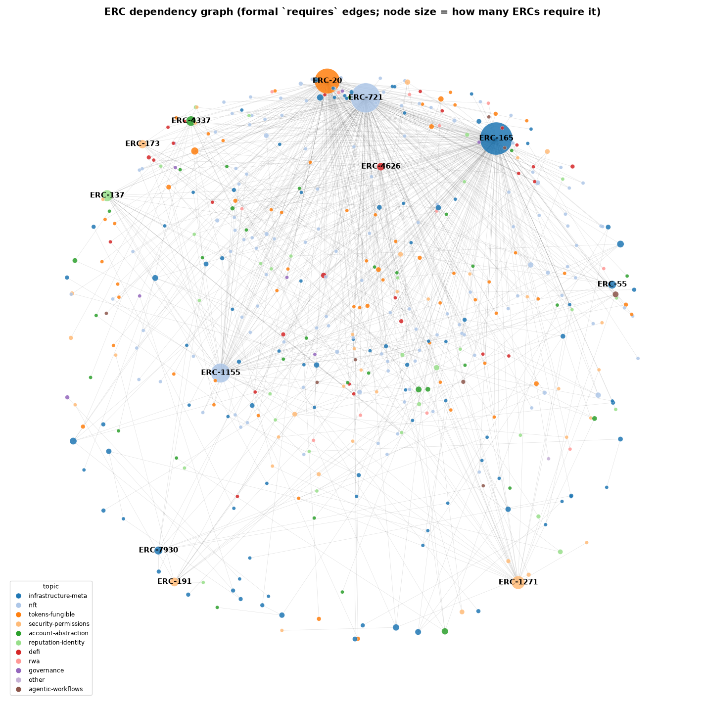

Building the directed `requires` graph (in-corpus edges only) confirms and sharpens the influence picture:

- **778 dependency edges** connect **446 ERCs**; the other **154 (26%) are isolated** islands.
- Of the connected ERCs, **425 sit in a single giant component** — the standards ecosystem is essentially *one* interlocking structure, not many separate clusters. Only 9 tiny weakly-connected components exist.
- The hubs that hold it together are unmistakable in the layout: **ERC-165, 721, 20, 1155** are the gravitational centers, with the security/signing standards (1271, 191) and ENS (137) as secondary anchors.

The takeaway: Ethereum's application layer is a **single dependency web anchored on four standards**, with a long fringe of standalone proposals that nothing builds on.

---

## 2. Co-authorship network

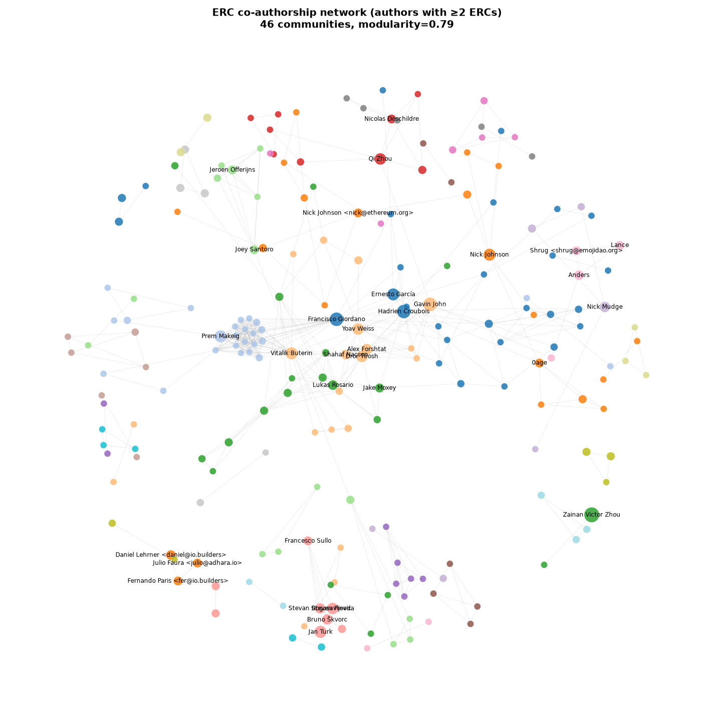

Treating authors as nodes and shared ERCs as edges (restricted to the 240 authors with ≥2 ERCs) yields a network with **very high modularity (0.79, 46 communities)** — meaning ERC authorship is organized into **sharply separated working groups** rather than one diffuse crowd. The largest communities map cleanly onto real-world teams:

| Community | Size | Who | What they ship |
|---|---|---|---|
| OpenZeppelin | 24 | Croubois, Giordano, García, vectorized | infrastructure & token libraries |
| ENS / naming | 20 | Makeig, Lau, Stronati | naming, identity, resolvers |
| Early core | 16 | Nick Johnson, 0age, Baylina, ricmoo | foundational primitives |
| Account abstraction | 15 | Buterin, Weiss, Tirosh, Forshtat | ERC-4337 stack |
| Wallet / interop | 15 | Rosario, Moxey, Gomes | wallet-call / connection standards |
| DeFi vaults | 10 | Santoro, Cuesta Cañada | ERC-4626 and yield |

The bridge authors identified earlier (Giordano, 44 co-authors; Croubois, 37; Buterin, 37) are the few people who connect these otherwise-siloed communities.

---

## 3. Author success scorecard

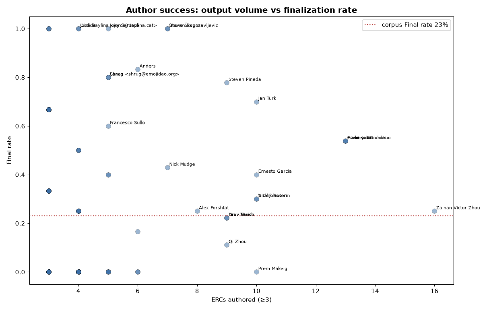

For the 94 authors with ≥3 ERCs, output volume and *success* diverge sharply (full table: `analysis/tables/author_scorecard.csv`):

- **High-volume, high-success — the RMRK/NFT team.** Bruno Škvorc and Stevan Bogosavljevic (7/7 Final, 100%), Steven Pineda (78%), Jan Turk (70%), Anders (83%) — all shipping modular-NFT standards, and **fast** (median ~150 days to Final).
- **Prolific generalists, moderate success.** The OpenZeppelin trio Giordano / Croubois / Pandapip1 each land ~54% Final but slower (~500 days). Zainan Zhou is the single most prolific (16 ERCs) but only 25% Final.
- **High-volume, *zero* success.** Prem Makeig (0/10, ENS work still in flight) and Daniel Lehrner (0/6, all Stagnant) — two very different stories behind the same 0% rate.
- **The account-abstraction tax.** Tirosh, Weiss, Forshtat all cluster at ~22% Final with the longest median times to Final in the whole dataset (**~1,320 days**). Hard, security-critical work is slow and uncertain even for its most expert authors.

The lesson: **finalization rate is a function of *domain*, not effort** — NFT-extension authors finalize quickly and often; AA and ENS authors grind for years.

---

## 4. Topic convergence

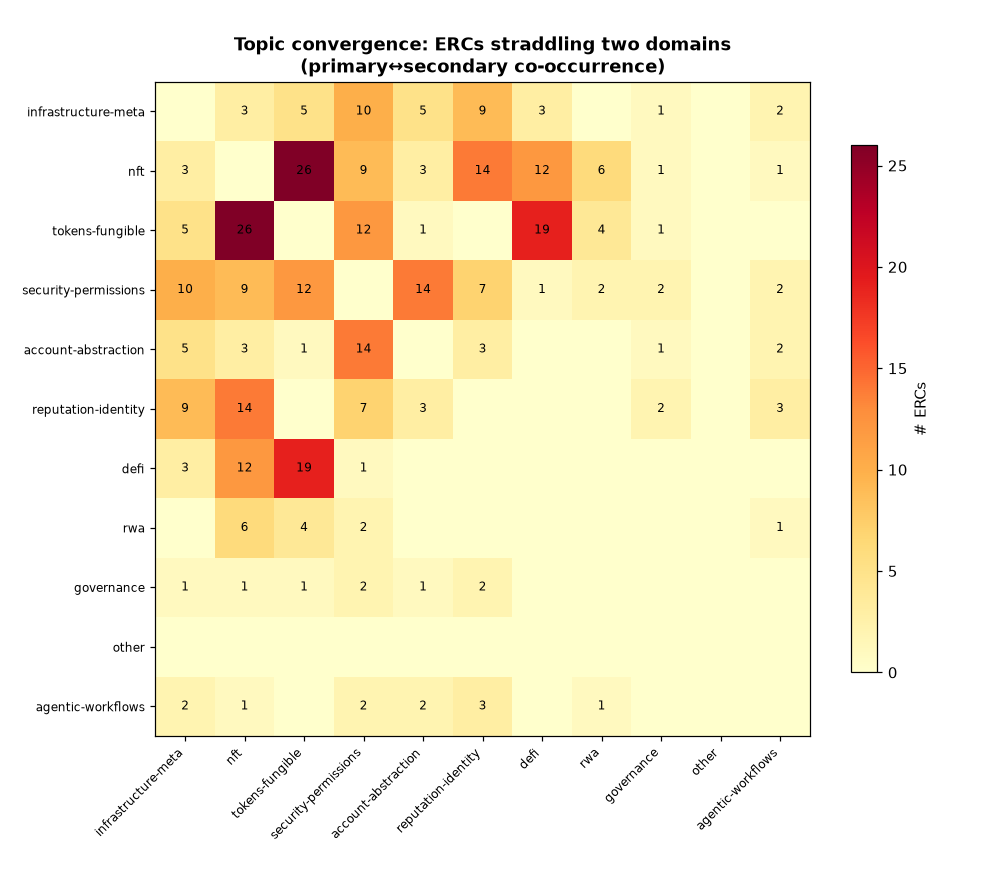

The symmetric primary↔secondary co-occurrence matrix maps where domains fuse. The strongest bridges:

| Bridge | ERCs |
|---|---|
| nft ↔ tokens-fungible | 26 |
| defi ↔ tokens-fungible | 19 |
| account-abstraction ↔ security-permissions | 14 |
| nft ↔ reputation-identity | 14 |
| security-permissions ↔ tokens-fungible | 12 |
| defi ↔ nft | 12 |

These are the seams of innovation: **semi-fungible / multi-token** designs (nft↔fungible), **token-based DeFi** primitives (defi↔fungible), **session-key authorization** for smart accounts (AA↔permissions), and **soulbound / credential tokens** (nft↔identity).

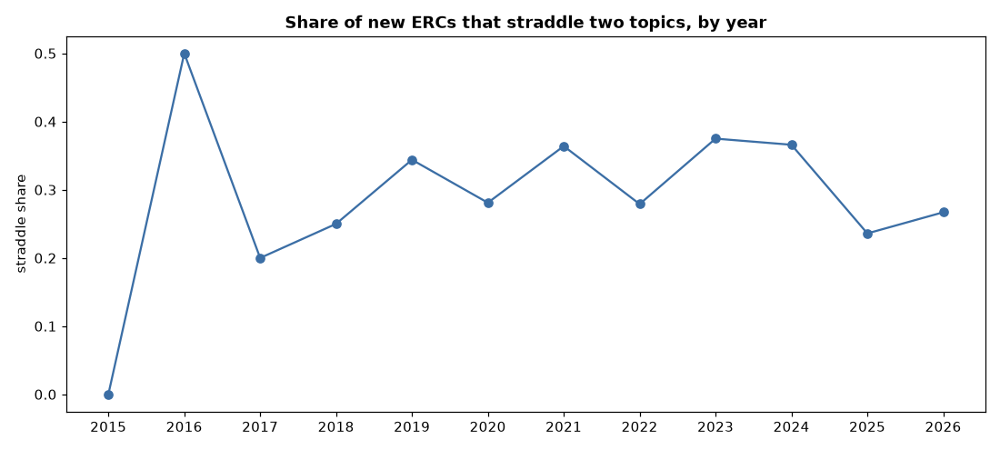

Roughly **a third of ERCs straddle two domains, and that share has held steady** (~0.28–0.38) since 2019 — cross-domain composition is a structural feature of ERC design, not a passing trend.

---

## 5. Finalization predictor

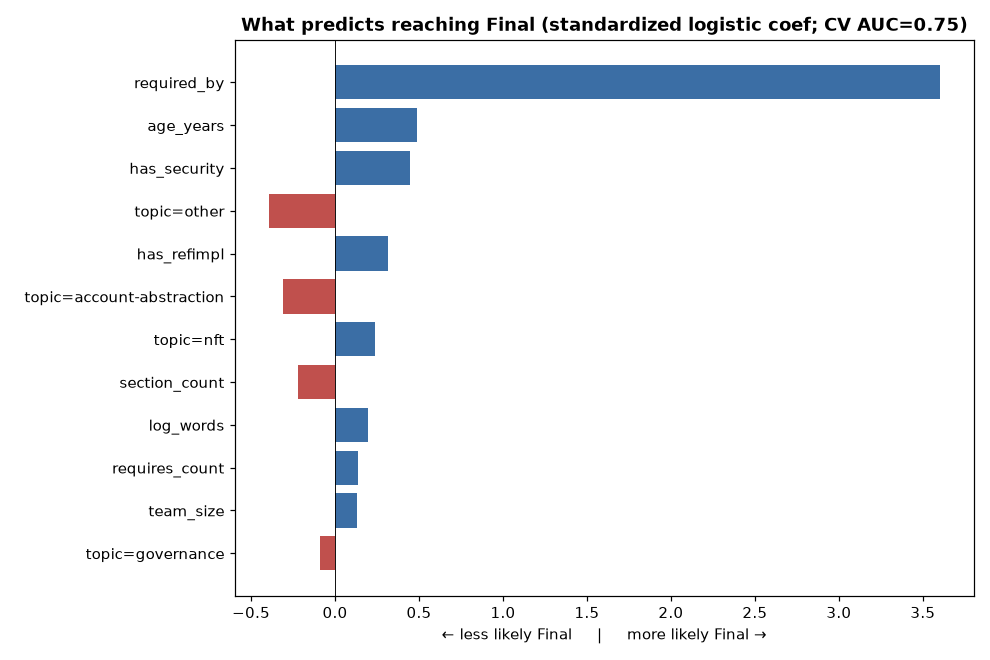

A logistic-regression model predicting `Final` from structural features achieves **cross-validated ROC-AUC 0.75 ± 0.09** — modest but real signal. Standardized coefficients (as odds ratios):

| Feature | Effect | Reading |
|---|---|---|
| **required_by** | ↑↑ (OR ≫1) | being depended-upon is by far the strongest correlate of Final |
| age_years | ↑ (1.63) | older proposals have had time to finalize |
| has_security_considerations | ↑ (1.56) | the EIP-1 rigor signal matters |
| has_reference_impl | ↑ (1.37) | working code helps |
| topic = other / account-abstraction | ↓ (0.67 / 0.74) | ill-defined or AA proposals finalize less |
| has_test_cases | ≈ (1.08) | **surprisingly weak** — tests barely move the odds |

A depth-3 decision tree distills the same logic into one rule: **if an ERC is required by ≥2 others → Final; otherwise it usually isn't** (the lone exception being large-team NFT standards).

> **Caveat — endogeneity.** `required_by` is partly circular: developers build on standards *because* they're stable/Final, and foundational standards finalize anyway. So it's a strong *correlate*, not a clean *cause*. Stripping it out, the honest, actionable predictors are **age, a security-considerations section, a reference implementation, and avoiding the account-abstraction/"other" domains** — and notably **not** test cases.

---

## 6. Survival analysis

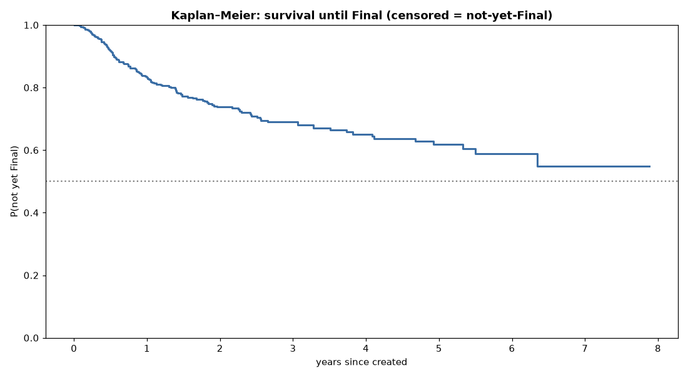

Naive time-to-Final (median 306 days) only looks at *winners*. Kaplan–Meier — which correctly treats the 460 not-yet-Final ERCs as **right-censored** — tells the real story (597 ERCs, 137 events):

- **The median is never reached.** Fewer than half of all ERCs ever finalize within the observed window, so the survival curve never crosses 0.5.
- Cumulative probability of having finalized: **17% by 1 year, 26% by 2 years, 31% by 3 years.** After that it flattens — if an ERC hasn't finalized in ~3 years, it almost never will.

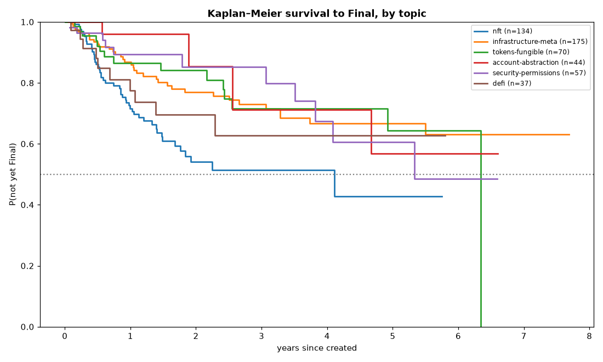

By topic the contrast is stark:

| Topic | Finalized by 2 yrs | Median time to Final* |
|---|---|---|
| **nft** | **46%** | 4.1 yrs |
| defi | 30% | never reaches 50% |
| infrastructure-meta | 23% | never |
| tokens-fungible | 16% | 6.3 yrs |
| security-permissions | 15% | 5.3 yrs |
| **account-abstraction** | **15%** | never |

*\*Median here = the age by which half of all proposals in the topic have finalized, counting the many that never do — hence far longer than the winners-only 248-day NFT figure.*

NFT standards are both the most likely to finalize and the fastest; **account-abstraction is the pipeline's hardest slog** — only 1 in 7 finalize within two years.

---

## 7. Churn & contributor retention

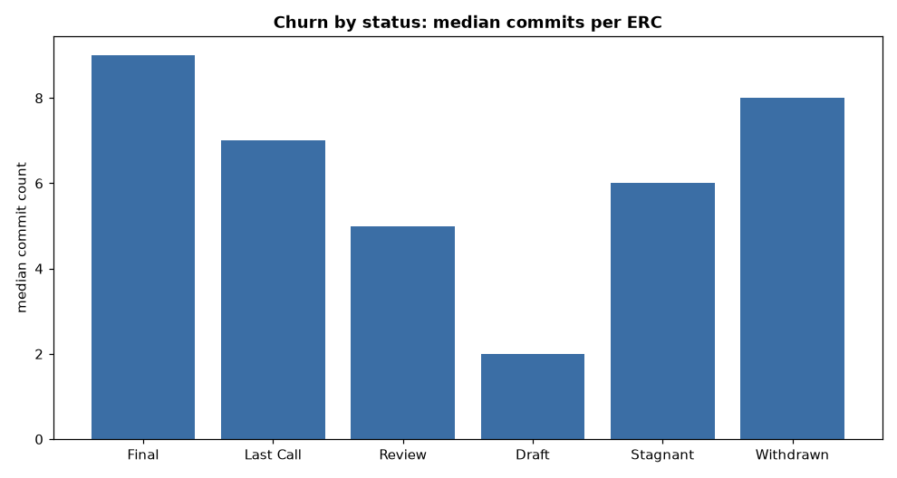

Git churn (commit count as a revision/contention proxy) tracks engagement and outcome:

- **Final ERCs are the most worked** (median 9 commits, 4 committers); **Drafts the least** (median **2 commits, 1 committer**) — most Drafts are written once and abandoned, never attracting a second contributor.
- Stagnant ERCs sit in between (6 commits) — they got attention, then stalled.
- **The most-revised standards are the load-bearing ones:** ERC-721 (95 commits, 21 committers), Diamonds/2535 (77), 1155 (72), 4337 (60). The one high-churn *Draft* is **ERC-6900 Modular Smart Contract Accounts** (30 commits) — a contested, actively-negotiated AA standard to watch.

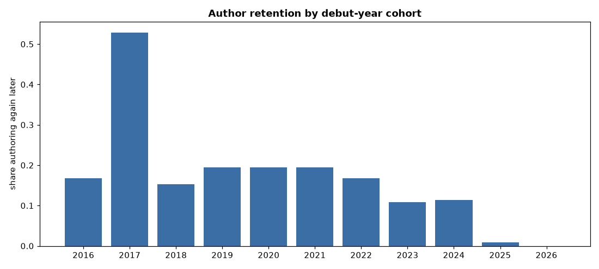
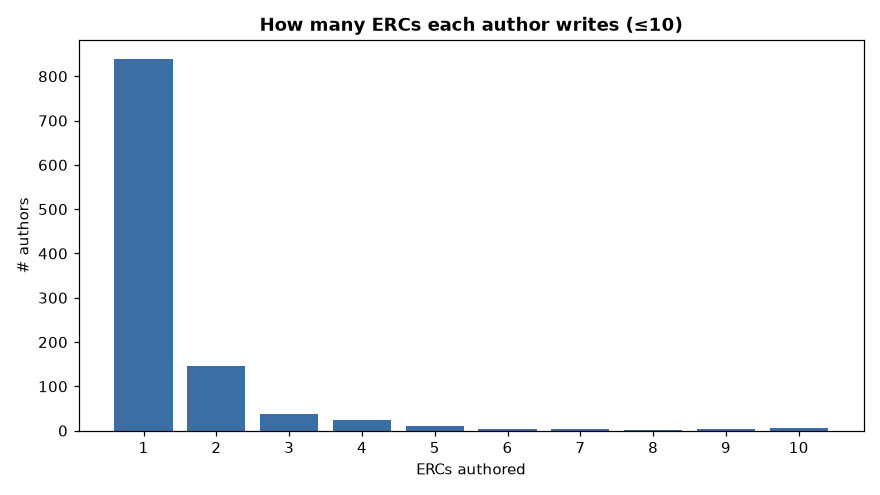

Contributor retention reveals a **transient base around a small persistent core**:

- **78% of all 1,080 authors wrote exactly one ERC, ever** — and never returned. Only 240 are recurring; median tenure among them is just **1 year**.
- **Debut-cohort retention is declining**: 53% of 2017 debutants authored again later, versus ~11% of 2023–2024 debutants. As the process scaled, the share of "drive-by" authors grew.
- The persistent core is tiny and identifiable: Nick Johnson and Nick Mudge (8 active years each), Zhou, Giordano, Croubois (6–7 years) — the same names anchoring the dependency hubs and co-authorship communities.

---

## Cross-study synthesis

The seven studies reinforce one structural picture:

1. **A small core carries the ecosystem on every axis** — the same handful of standards (165/721/20/1155), teams (OpenZeppelin, RMRK, AA group), and individuals (Johnson, Giordano, Buterin) dominate the dependency graph, the co-authorship network, the success scorecard, and contributor retention simultaneously.
2. **Domain determines destiny.** Whether an ERC finalizes — and how fast — is driven far more by *what* it is than *who* writes it or how hard they try: NFT extensions finalize fast and often; account-abstraction grinds for ~4 years with a 15% two-year success rate.
3. **The funnel is leaky by design and getting leakier.** Survival analysis says <31% ever finalize and the window effectively closes at 3 years; retention says most contributors leave after one attempt; churn says most Drafts die after a single commit. The process reliably elevates a well-supported few and lets the rest lapse.

## Limitations

- The **predictor's top feature (`required_by`) is endogenous** — interpret it as correlation, not a lever.
- **Survival analysis treats `Stagnant`/`Withdrawn` as censored** (could theoretically revive); treating them as terminal non-events would lower finalization probabilities further.
- **Author identity is string-based** — the same person under different handle/email forms (e.g. two "Nick Johnson" nodes) can split, slightly inflating author counts and splitting network nodes.
- Topics are model-assigned; the 3 renumbered ERCs with negative durations are excluded from timing throughout.

### New artifacts

| File | Contents |
|---|---|
| `analysis/further_metrics.json` | every statistic above |
| `analysis/tables/author_scorecard.csv` | per-author volume / Final rate / time-to-Final / topic |
| `analysis/figures/dependency_graph.png`, `coauthor_network.png` | the two network visualizations |
| `analysis/figures/author_scorecard.png`, `topic_convergence.png`, `straddle_trend.png` | scorecard & convergence |
| `analysis/figures/finalization_predictors.png` | predictor coefficients |
| `analysis/figures/km_overall.png`, `km_by_topic.png` | survival curves |
| `analysis/figures/churn_by_status.png`, `author_retention.png`, `ercs_per_author.png` | churn & retention |
| `further.py` | regenerates all of the above |
