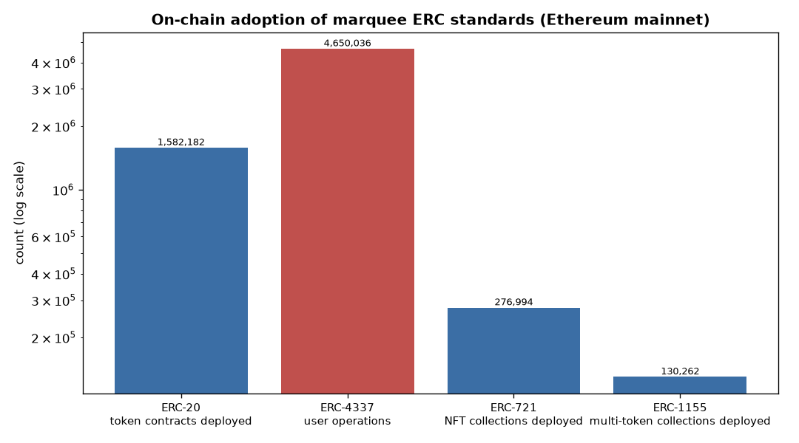
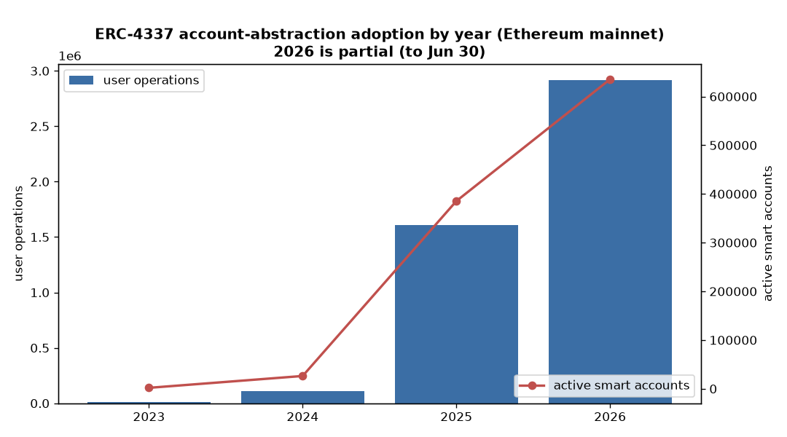

# On-Chain Adoption Analysis (#10)

*Which ERCs are actually **used on-chain**, not merely proposed or finalized? This study joins real Ethereum-mainnet usage (sourced from Dune Analytics' Spellbook) onto the dataset for the marquee standards with measurable footprints, and cross-references adoption against dependency influence, status, and discussion. Reproducible via `run_dune.py` (Dune REST API) + `build_adoption.py`; data in `erc_adoption.csv` and `analysis/adoption_metrics.json`. As of 2026-06-30.*

---

## Method & an inherent limit
On-chain "adoption" is only directly measurable for standards that leave a standardized fingerprint — a known contract type or event signature that indexers like Dune curate. That is true for a **handful of marquee standards**; the other ~596 ERCs (interfaces, process/meta standards, registries, extensions) have **no directly-countable mainnet footprint**. So this is necessarily a *marquee-standards* analysis, and the headline finding is partly that very fact: **adoption is extraordinarily concentrated.**

Metrics were pulled from Dune Spellbook tables (`tokens.erc20`, `tokens.nft`, `account_abstraction_erc4337.userops`), Ethereum mainnet only, via the Dune REST API.

---

## The numbers

| Standard | Status | Dep. in-degree | On-chain footprint (Ethereum mainnet) |
|---|---|---|---|
| **ERC-20** Token | Final | 104 | **1,582,182** token contracts deployed |
| **ERC-721** NFT | Final | 145 | **276,994** collections deployed |
| **ERC-1155** Multi-Token | Final | 60 | **130,262** collections deployed |
| **ERC-4337** Account Abstraction | Final | 14 | **4,650,036** user operations · **986,466** smart accounts · 837 bundlers |

Two different shapes of dominance: **ERC-20 is the most *deployed*** (1.6M contracts — the universal money lego), while **ERC-721 is the most *depended-upon*** (in-degree 145 — the most-built-upon). ERC-4337 is newer and less foundational by dependencies (in-degree 14) but already carries enormous *activity* (4.65M operations).

---

## Finding 1 — Adoption aligns with influence and finalization

**All four standards with mass adoption are `Final`, and all four sit at the very top of the dependency graph** (the bedrock identified in the influence analysis: ERC-165/721/20/1155 + the AA layer). This empirically closes the "proposed vs. adopted" loop the local data alone couldn't:

> The standards the ecosystem *builds on* (high dependency in-degree) and the standards it *talks about most* are the same standards it actually *uses at scale*. Influence, attention, and adoption coincide at the top — and fall off a cliff below it. Of 600 proposals, on the order of a dozen have any meaningful on-chain life; four dominate.

This is the on-chain confirmation of the report-wide thesis that **a tiny core carries the entire ecosystem.**

---

## Finding 2 — Adoption *lags* standardization by years

ERC-4337 is the clearest case because it's recent enough to watch from birth. It was proposed in 2021 and finalized, but **on-chain usage only exploded two-to-four years later:**

| Year | User operations | Active smart accounts |
|---|---|---|
| 2023 | 12,021 | 1,877 |
| 2024 | 111,275 | 26,205 |
| 2025 | 1,609,578 | 385,327 |
| 2026 (to Jun) | 2,917,162 | 635,383 |

That's a **~240× jump in annual user-ops from 2023 to 2025**, still accelerating in 2026. The proposal wave (account-abstraction peaked in filings in 2023, per the time-series analysis) was a **leading indicator**; real adoption trails it by years.

This reframes several earlier findings: the slow finalization of AA standards (§ survival analysis: ~4-year medians) and their low test coverage look less like dysfunction and more like a domain whose **specification, finalization, and adoption are each separated by multi-year lags** — the spec work of 2021–2023 is the live infrastructure of 2025–2026.

---

## Key findings
1. **Adoption is hyper-concentrated:** four standards (ERC-20/721/1155/4337) account for millions of on-chain artifacts; the other ~596 ERCs have no directly-measurable mainnet footprint.
2. **Adoption ⊆ influence ⊆ finalization:** every mass-adopted standard is Final and top-of-graph — the same core that dominates dependencies and discussion.
3. **ERC-20 leads on deployments (1.6M), ERC-721 on dependencies, ERC-4337 on activity (4.65M ops).**
4. **Adoption lags standardization by 2–4 years** — ERC-4337 usage grew ~240× from 2023→2025, long after the proposal peak. Proposals are a leading indicator of where the chain goes next.

## Limitations
- **Ethereum mainnet only.** L2 usage is excluded — a large undercount, especially for ERC-4337 (predominantly an L2 phenomenon) and ERC-1155. Treat these as mainnet floors, not totals.
- **Deployment ≠ active use.** Contract counts include dead/test deployments; user-ops/active-accounts (for 4337) are the truer activity measure.
- **Marquee-only by necessity.** Standards without a curated on-chain signature (most ERCs) can't be measured this way; absence here is not evidence of non-use for, e.g., interface standards like ERC-165 that are embedded in others.
- **Forum-view join is partial** for these four: ERC-20/721/1155 use GitHub (not ethereum-magicians) for discussion, so their `forum_views` read 0 in `erc_adoption.csv` — a join artifact, not low engagement.
- Snapshot as of 2026-06-30; 2026 is a partial year.

### Artifacts
| File | Contents |
|---|---|
| `erc_adoption.csv` | marquee standards joined: status, in-degree, adoption metric |
| `analysis/adoption_raw.json` | raw Dune query results + the SQL used (reproducible) |
| `analysis/adoption_metrics.json` | computed cross-reference |
| `analysis/figures/adoption_marquee.png`, `adoption_erc4337_growth.png` | the two charts |
| `run_dune.py` | Dune REST API runner (key read from gitignored `.dune_key`/env) |
| `build_adoption.py` | builds the dataset, figures, metrics |
