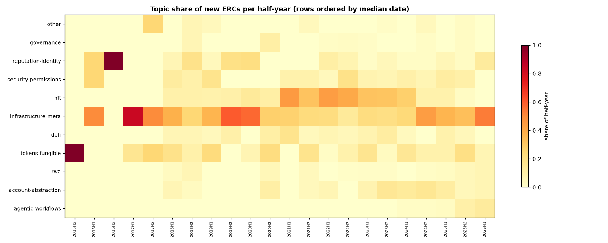
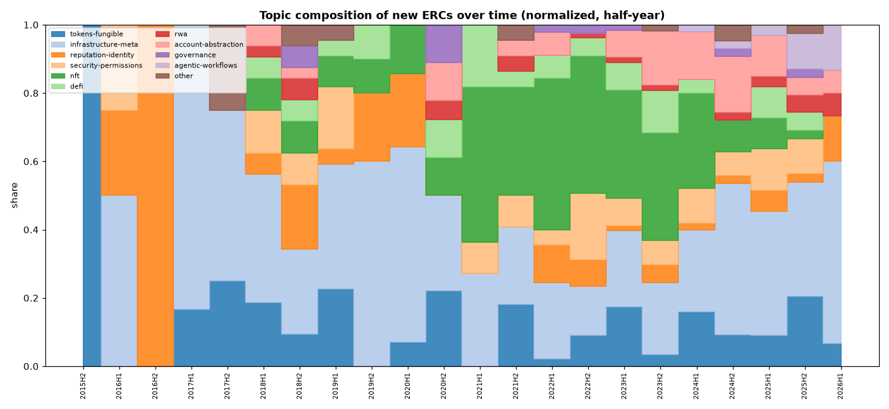

# ERC Topics Over Time — A Time-Series Analysis

*Do ERC categories cluster into distinct periods? This study tracks the semantic `topic` mix at quarter/half-year resolution, measures how tightly each topic concentrates in time (creation-date percentiles), and detects eras data-drivenly via optimal contiguous segmentation of the topic mix. (`category`/`type` frontmatter are constant, so `topic` is the analytical category here.) Reproducible from `timeseries.py`; data in `analysis/timeseries_metrics.json`.*

---

## Headline

ERC activity falls into **four clean, consecutive eras**, and individual topics arrive as **distinct waves** — some sharply clustered (NFT, account-abstraction, agentic), others persistent background layers (infrastructure, fungible tokens). The single most concentrated regime is the **2021–2022 NFT boom**, when NFTs were 41% of all new ERCs.

---

## 1. Topics arrive as datable waves

Sorting topics by the **median creation date** of their ERCs, and drawing the middle-50% span (25th–75th percentile of when each topic's ERCs were filed), produces a clear chronological ordering of the ecosystem's preoccupations. The **IQR width** (how many years the middle 50% spans) separates *tight waves* from *persistent layers*:

| Topic | n | First | Median yr | Middle-50% span | Wave width | Peak |
|---|---|---|---|---|---|---|
| **nft** | 136 | 2018.1 | 2022.8 | 2022.2 – 2023.6 | **1.4 yr** (tight) | 2022 Q3 |
| **account-abstraction** | 44 | 2018.3 | 2024.0 | 2023.1 – 2024.8 | **1.6 yr** (tight) | 2023 Q3 |
| **agentic-workflows** | 9 | 2024.3 | 2025.6 | 2025.4 – 2025.8 | **0.4 yr** (very tight) | 2025 Q3 |
| governance | 10 | 2018.5 | 2022.1 | 2020.5 – 2022.5 | 2.0 yr | 2018 Q3 |
| security-permissions | 57 | 2016.1 | 2022.7 | 2021.8 – 2024.1 | 2.3 yr | 2022 Q3 |
| defi | 37 | 2018.0 | 2023.2 | 2021.3 – 2023.9 | 2.7 yr | 2023 Q4 |
| tokens-fungible | 71 | 2015.9 | 2023.2 | 2020.3 – 2024.3 | 4.0 yr (persistent) | 2023 Q2 |
| infrastructure-meta | 175 | 2016.0 | 2023.1 | 2020.0 – 2024.7 | 4.7 yr (persistent) | 2024 Q4 |
| reputation-identity | 39 | 2016.3 | 2022.3 | 2018.8 – 2023.5 | 4.7 yr (persistent) | 2018 Q3 |

Two distinct shapes emerge:

- **Tight waves** — `nft` (1.4 yr), `account-abstraction` (1.6 yr), and especially `agentic-workflows` (**0.4 yr**, the most temporally concentrated topic in the dataset) — burst onto the scene in a narrow window. These are the trend-driven categories.
- **Persistent layers** — `infrastructure-meta`, `tokens-fungible`, `reputation-identity` span 4+ years of steady activity. They're the background plumbing that's *always* being worked on, not a passing fashion. Notably, **infrastructure-meta peaks most recently (2024 Q4)** — the plumbing layer is not just persistent but currently accelerating.

The wave order also traces the ecosystem's evolution: tokens & identity (2015–18) → NFT (2022) → DeFi/security (2022–23) → account-abstraction (2023–24) → **agentic-workflows (2025)**.

---

## 2. The topic mix shifts in clear regimes

The half-year heatmap (rows ordered by median date) and the normalized composition area chart show the mix is **not stationary** — bands of intensity cluster in specific periods: a fungible-token/identity band early, a bright NFT band in 2021–2022, then an account-abstraction band emerging 2023–2024 and the first agentic band in 2025.

---

## 3. Data-driven eras (optimal contiguous segmentation)

Rather than imposing dates, I segmented the ordered half-year topic-mix vectors into the optimal **K consecutive eras** by dynamic programming (minimizing within-era variance, weighted by volume; K=4 chosen by elbow). The result is four coherent regimes:

| Era | Span | ERCs | Dominant topics | Character |
|---|---|---|---|---|
| **1** | 2015 H2 – 2020 H2 | 145 | infrastructure-meta (39%), tokens-fungible (15%), reputation-identity (12%) | **Primitives & plumbing** — building the base layer |
| **2** | 2021 H1 – 2022 H2 | 155 | **nft (41%)**, infrastructure-meta (19%), security-permissions (13%) | **The NFT boom** — one category dominates |
| **3** | 2023 H1 – 2024 H1 | 170 | nft (31%), infrastructure-meta (22%), tokens-fungible (12%) | **Post-boom diversification** — NFT cools, mix broadens |
| **4** | 2024 H2 – 2026 H1 | 130 | infrastructure-meta (40%), tokens-fungible (12%), **account-abstraction (11%)** | **Accounts & infrastructure** — plumbing resurges, AA rises |

The segmentation independently recovers the intuitive narrative: a long foundational era, a sharp **NFT-dominated boom (Era 2, NFTs at 41% vs the 23% corpus baseline)**, a broadening transition, and a current era defined by infrastructure and the rise of account abstraction.

---

## 4. What's rising now vs. what has peaked

Using each topic's share of its own ERCs filed in 2024+ (`recent_share`):

- **Ascendant (>⅓ of their ERCs are recent):** agentic-workflows (**100%**), account-abstraction (48%), rwa (39%), infrastructure-meta (37%), tokens-fungible (34%).
- **Past their peak (<20% recent):** nft (16%), reputation-identity (18%), defi (19%).

The contrast crystallizes the moment: **NFTs and DeFi have had their wave; accounts, agents, real-world assets, and infrastructure are the active frontier.**

---

## Key findings

1. **Yes — topics cluster around specific periods.** Three categories (nft, account-abstraction, agentic-workflows) arrive as tight 0.4–1.6-year waves; the rest are either broad multi-year layers or smaller bursts.
2. **Four consecutive eras** emerge from the data without imposed dates: Primitives (→2020) → **NFT boom (2021–22)** → Diversification (2023–24) → Accounts & infrastructure (2024→).
3. **The NFT boom is the sharpest regime** — 41% of all ERCs in 2021–22, peaking at 22 NFT ERCs in a single quarter (2022 Q3).
4. **Infrastructure-meta is the exception to "waves"** — persistent across all 11 years *and* peaking most recently (2024 Q4): the plumbing never stops.
5. **The frontier has rotated** to account-abstraction (2023–24) and agentic-workflows (2025, the tightest and newest wave).

## Limitations
- Dating uses frontmatter `created` (proposal date), not adoption; topics are model-assigned.
- Tiny topics (governance, agentic-workflows, rwa, other; n≤13) give noisier percentiles — peak quarters for these rest on few ERCs.
- 2026 is a partial year, slightly depressing the latest periods.

### Artifacts
| File | Contents |
|---|---|
| `analysis/timeseries_metrics.json` | per-topic temporal stats, eras, peak quarters |
| `analysis/tables/topic_temporal_stats.csv` | topic × {n, percentile dates, IQR, peak, recent share} |
| `analysis/tables/topic_by_quarter.csv` | topic counts per quarter |
| `analysis/figures/topic_era_spans.png` | the wave chart |
| `analysis/figures/topic_halfyear_heatmap.png`, `topic_share_area.png` | composition over time |
| `analysis/figures/eras_timeline.png` | the four detected eras |
| `timeseries.py` | regenerates everything |
